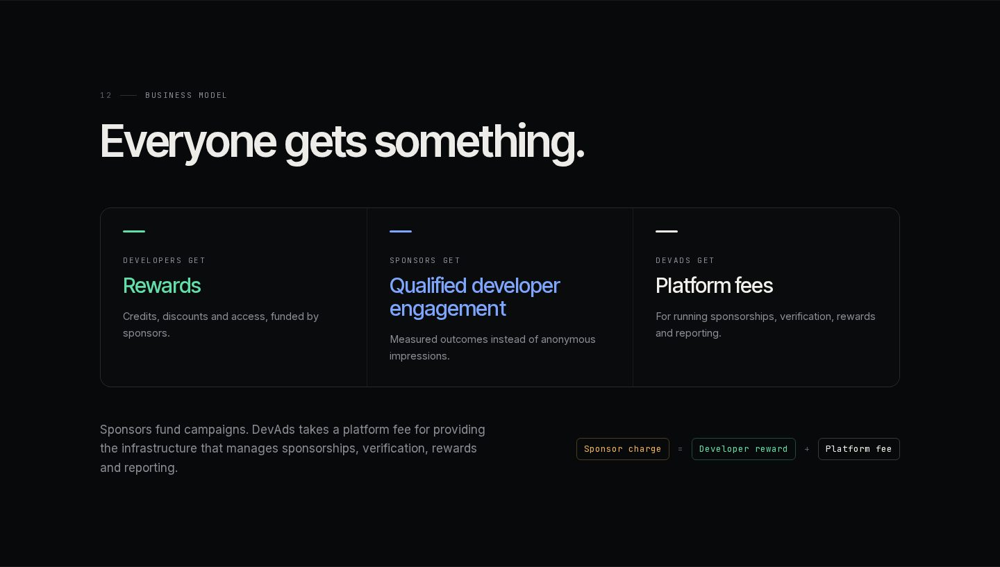
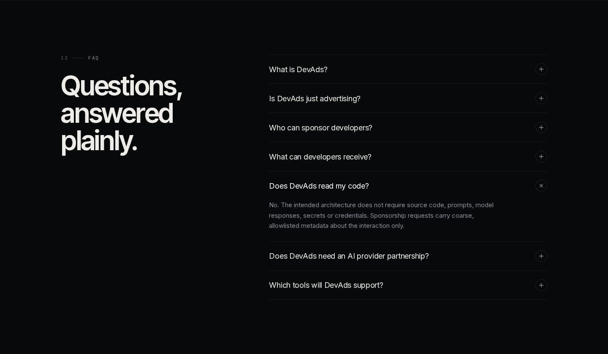
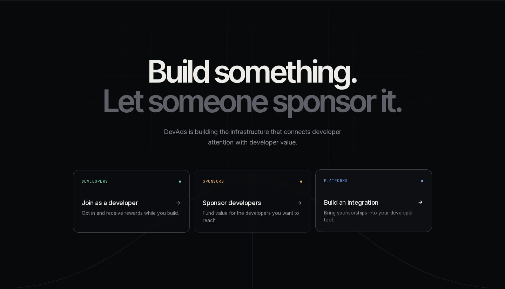
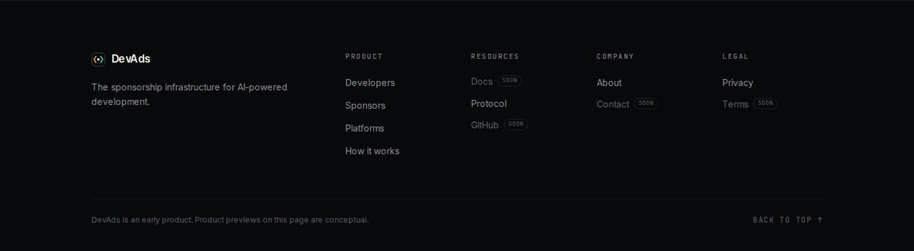

# DevAds

**The sponsorship infrastructure for AI-powered development.**

**Website: [devads-app.vercel.app](https://devads-app.vercel.app)**

[](https://devads-app.vercel.app)

Companies sponsor developers. Developers receive value. DevAds powers the
exchange. The first product built on it is a developer advertising network:

- **Developers** install a VS Code extension, opt in, and earn a revenue
  share from small, tasteful sponsored cards shown only during wait time
  they were already spending -- builds, installs, tests. If your command
  finishes before the minimum wait threshold, you never see an ad, and you
  can turn it off in one click.
- **Advertisers** create a campaign, target it by language/framework/
  runtime/platform/country, and reach developers inside the tool they're
  already using -- not a webpage, not a pre-roll video.
- **The platform** takes a configurable cut of advertiser spend and pays
  the rest to the developer whose wait time earned it, tracked in a
  transparent, auditable ledger.

VS Code is the first client. The backend is client-agnostic by design --
see [docs/architecture.md](./docs/architecture.md) for how a CLI,
JetBrains plugin, or browser extension would plug into the same ad-server
later.

```
$ npm run build
  building...

                                          ┌──────────────────────────────┐
                                          │ SPONSORED                    │
                                          │ Ship faster with Acme Cloud  │
                                          │ Zero-config deploys for Node │
                                          │ [ Learn more ]               │
                                          └──────────────────────────────┘
  build complete ✓
```

*(Static mockup of the VS Code status-bar card -- a real recording is on
the list; see the note in [docs/developer-guide.md](./docs/developer-guide.md).)*

## The website

[devads-app.vercel.app](https://devads-app.vercel.app) tells the DevAds
story from top to bottom. The diagrams use three colors consistently:
**amber** for sponsor funding, **mint** for developer value and **blue**
for verified engagement. Every product preview on the site is labelled
*Conceptual preview* or *Illustrative example*; none of the figures are
real customers or results. Screenshots are of the production build at
1440px wide unless noted.

### Try it: a sponsored opportunity, step by step

The hero includes a fictional opportunity card. Pressing it plays through
what DevAds does between the sponsor and the developer.

| 1. The developer sees an offer | 2. DevAds verifies the engagement | 3. The reward lands in the wallet |
| :---: | :---: | :---: |
|  |  |  |

In the sponsor section, choosing an objective updates the campaign preview
(here, *Event registration* turns the outcome metric into *Registrations*):


### Page by page

**1. The shift.** AI changed how developers build, and what building
costs.


**2. A new model.** Don't just advertise to developers; sponsor them.


**3. The economic loop.** Six steps from a funded campaign to the platform
fee. The loop advances on its own and each step can be selected.


**4. For developers.** The rewards developers can receive, with a
conceptual wallet.


**5. Developer privacy.** What stays in the developer's session, and the
coarse, allowlisted metadata a sponsorship event carries.


**6. For sponsors.** A conceptual campaign dashboard, sponsor objectives,
and the categories of organizations that can sponsor.


**7. For platforms.** How developer tools can bring sponsorships into their
own experiences.


**8. The protocol.** Real `@devads/ad-sdk` calls, and the stack from
clients to sponsors. VS Code is the only client connected today.


**9. Why DevAds.** Four principles: developer controlled, sponsor funded,
outcome focused, platform ready.


**10. From impression to value.** Each line lights up as it scrolls into
view.


**11. Imagine this.** An illustrative campaign from funding to platform
fee.


**12. Infrastructure.** What sits under the simple experience the developer
sees.


**13. Business model.** Developers get rewards, sponsors get qualified
engagement, DevAds gets platform fees.



**14. FAQ.**



**15. Get started.** One path each for developers, sponsors and platforms.





### On mobile

The layout is designed for phones rather than shrunk from desktop
(captured at 390px).

<p>
  
  &nbsp;
  
</p>

## How it works

```
command starts (npm install, cargo build, docker build, ...)
        v
still running after devads.minimumWaitSeconds? -> ask the ad server
        v
server re-validates: opted in? eligible campaign? frequency cap OK? budget OK?
        v
still running when the response comes back? -> show a compact status-bar card
        v
command ends / dismissed -> card disappears immediately, view reported
```

See [docs/architecture.md](./docs/architecture.md) for the full data flow
and design rationale.

## Privacy

Strict allowlist telemetry only: detected language/runtime/platform and the
*name* of the command (e.g. `npm`, never full arguments). Never source
code, file contents, environment variables, or secrets. Full detail:
[docs/privacy.md](./docs/privacy.md).

## Repository layout

```
apps/
  web/                    Public site (devads-app.vercel.app) + developer dashboard (Next.js)
  advertiser-dashboard/   Campaign creation & management (Next.js)
  admin-dashboard/        Approval queue, platform analytics (Next.js)
  vscode-extension/       The VS Code extension itself

packages/
  database/    Prisma schema, migrations, seed data
  shared/      Money utilities, Zod DTOs, Payout/Billing provider abstraction
  auth/        Sessions, magic links, device-auth codes, password hashing
  targeting/   Pure ad eligibility/targeting/frequency-cap/budget engine
  ad-sdk/      DevAds Protocol SDK and client adapter runtime

services/
  ad-server/   Fastify API -- the one place all money/eligibility logic lives

docs/          architecture, sponsorship architecture, client adapters, redemption, privacy, advertiser guide, developer guide, OpenAPI spec
scripts/       demo.js (one-command setup), demo-wait.js (simulated slow command)
```

## Running locally

Requires Node 20+, Docker Desktop.

```bash
git clone https://github.com/HenryMorganDibie/devads.git
cd devads
cp .env.example .env      # ad-server loads this automatically
npm install                # also generates the Prisma client (postinstall)
npm run demo                # brings up Postgres + MinIO, migrates, seeds,
                             # and builds the packages the ad-server needs
```

`npm run demo` is idempotent -- safe to re-run against an already-running
stack. This whole sequence (including the two commands below) is tested
from a genuinely fresh `git clone` before every push, not just assumed to
still work.

Then, in separate terminals:

```bash
npm run dev -w @devads/ad-server
NEXT_PUBLIC_AD_SERVER_URL=http://localhost:4000 npm run dev -w @devads/web
NEXT_PUBLIC_AD_SERVER_URL=http://localhost:4000 npm run dev -w @devads/advertiser-dashboard
NEXT_PUBLIC_AD_SERVER_URL=http://localhost:4000 npm run dev -w @devads/admin-dashboard
```

Seeded logins:

| Role | Email | Password |
|---|---|---|
| Admin | admin@devads.dev | admin12345 |
| Developer | dev@devads.dev | dev12345 |
| Advertiser | advertiser@devads.dev | advertiser12345 |

## Deployment

The public site is `apps/web`, deployed on Vercel as the `devads` project
and served at **https://devads-app.vercel.app**. Pushes to `main` deploy to
production; other branches get preview deployments.

- `NEXT_PUBLIC_SITE_URL=https://devads-app.vercel.app` is set in the
  project's production environment. It drives the canonical URL and Open
  Graph metadata, and `apps/web/middleware.ts` uses it to 308-redirect any
  other `*.vercel.app` production address (such as the auto-assigned
  `devads-seven.vercel.app`) to the canonical one.
- `NEXT_PUBLIC_AD_SERVER_URL` points the site at the ad-server. The
  ad-server (`services/ad-server`) is set up as the `devads-api` Vercel
  project; it is not live until its database and secret environment
  variables are configured, so sign-up and sign-in on the public site do
  not work yet.

## VS Code extension

```bash
npm run package -w @devads/vscode-extension    # produces devads-0.1.0.vsix
```

Install via **Extensions → ... → Install from VSIX**, or press F5 in
`apps/vscode-extension` (with that folder open) for an Extension
Development Host. Run **DevAds: Sign In**, then trigger a card with:

```bash
node scripts/demo-wait.js 30
```

Full walkthrough: [docs/developer-guide.md](./docs/developer-guide.md).

## Tests

```bash
npm test          # unit + integration tests across every workspace (turbo)
```

Integration tests run against a real Postgres (the `docker compose up
postgres` instance) and cover the full campaign → approval → ad selection →
qualified view → earnings ledger → payout lifecycle, plus idempotency,
frequency capping, concurrent-request safety (payouts, budget enforcement,
carry accounting -- each proven with real simultaneous HTTP requests, not
just serial calls), and the auth/ownership guards. Unit tests cover the
pure targeting engine, money math, object-storage upload validation, and
the extension's eligibility logic (no VS Code host required). 89 tests
total, all green from a fresh clone.

## Revenue model

CPM-based. Advertiser spend splits between platform and developer by a
configurable basis-points share (`DEFAULT_DEVELOPER_REVENUE_SHARE_BPS`,
default 60% to developers). All money is stored as integer minor units plus
a currency code -- never floating point, and never lost to per-impression
rounding (see [docs/architecture.md](./docs/architecture.md#money)).

## Security

- Client is never authoritative for money, impressions, identity, or
  eligibility -- the ad-server re-derives everything server-side from the
  caller's verified session, never from an id in the request body.
- Event reporting is idempotent (unique `event_id`); a retried/duplicated
  request can't double-pay.
- Session-token + resource-ownership checks guard every developer,
  earnings, campaign, and advertiser route; admin endpoints require an
  ADMIN-role session.
- Campaign spend and developer earnings are computed inside
  Postgres-row-locked transactions and payouts inside an advisory-locked
  one, so concurrent requests can't double-spend a budget or double-pay a
  balance -- each guarantee has a dedicated test that fires real
  concurrent HTTP requests and checks the totals.
- Creative uploads are validated server-side by MIME type and size, never
  trusted from the client.
- Rate limited (300 req/min default, 10/min on auth endpoints).
- CORS is locked to an explicit origin allowlist (not reflect-any-origin).
- Money columns carry CHECK constraints at the database level in addition
  to application-level integer-cents handling.

## Roadmap

Phase 1 (this MVP): VS Code extension, ad server, three dashboards, real
creative upload to object storage, demo mode. Phase 2+: CLI, JetBrains,
browser extension, real Stripe deployment, video creative rendering,
automated fraud anomaly detection. Full detail and rationale for what's
*not* built yet: [docs/architecture.md](./docs/architecture.md#roadmap).

Sponsorships (additive, server-side foundation): a provider-agnostic
developer sponsorship domain (development sessions, sponsored offers,
reward ledger and wallet) that sits alongside the ad system without
changing it. See [docs/sponsorship-architecture.md](./docs/sponsorship-architecture.md).
The VS Code extension is the only client wired to it so far (through
`@devads/ad-sdk`): it can show a reward-carrying sponsored offer during a
wait and list the developer's reward wallet. No other editor or agent
integration exists yet; the adapter boundary for building one, and what
each would legitimately require, is in [docs/adapters.md](./docs/adapters.md).
Developers can redeem reward units when an operator enables a redemption
provider (today: operator-fulfilled `manual`); see [docs/redemption.md](./docs/redemption.md).

## License

MIT (see [apps/vscode-extension/LICENSE](./apps/vscode-extension/LICENSE)).
